# 性能テスト用ドキュメント

このドキュメントは、md2pdfの性能テストを行うために、多種類の図表を大量に含んでいます。

## Mermaid図表（10個）

### 1. フローチャート
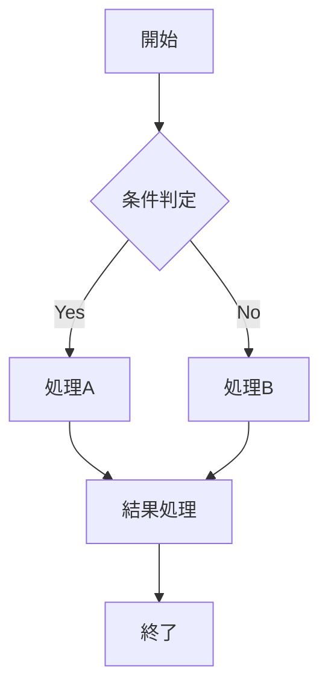

### 2. シーケンス図
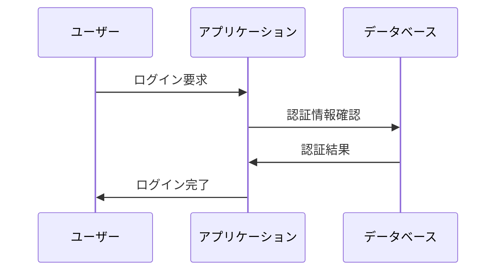

### 3. ガントチャート
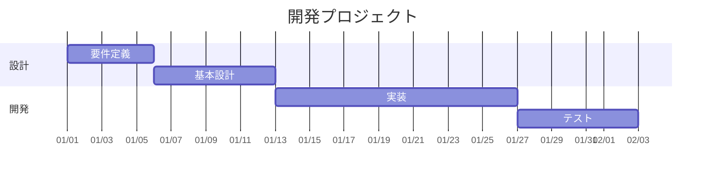

### 4. クラス図
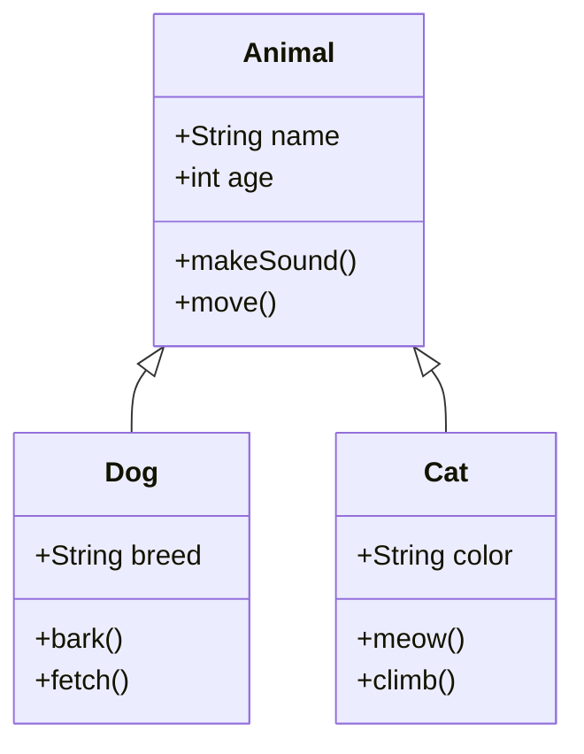

### 5. ER図
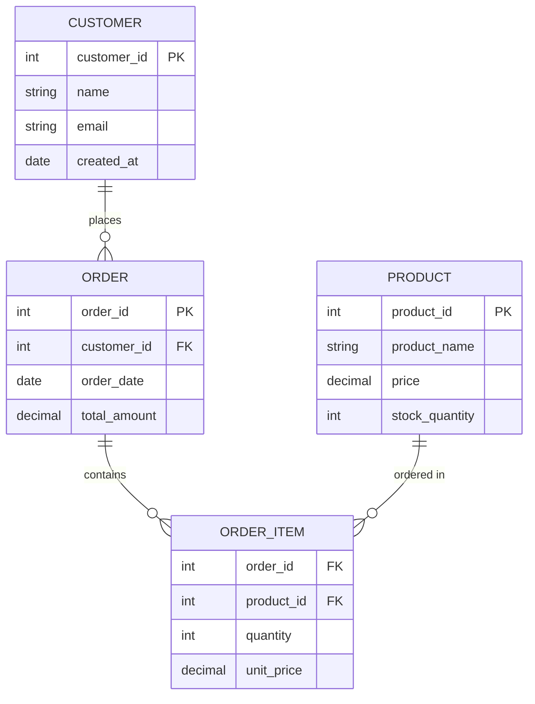

### 6. ステート図
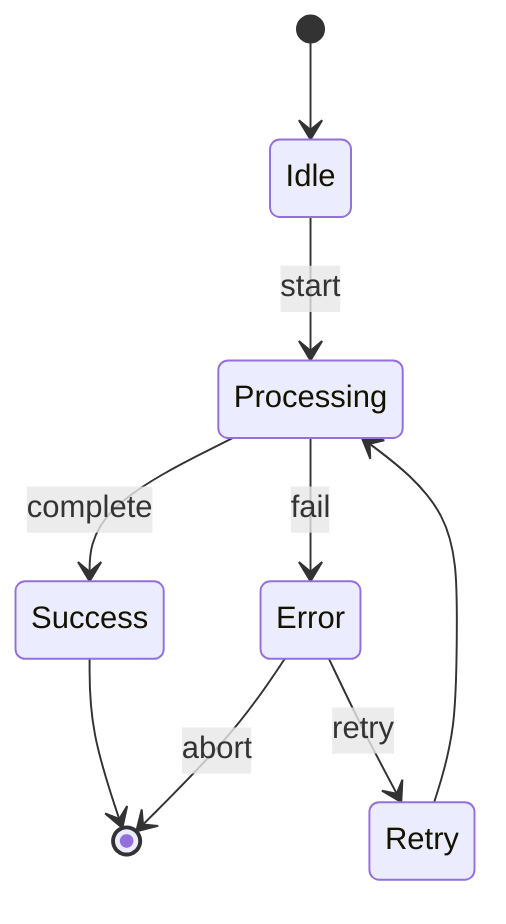

### 7. パイチャート
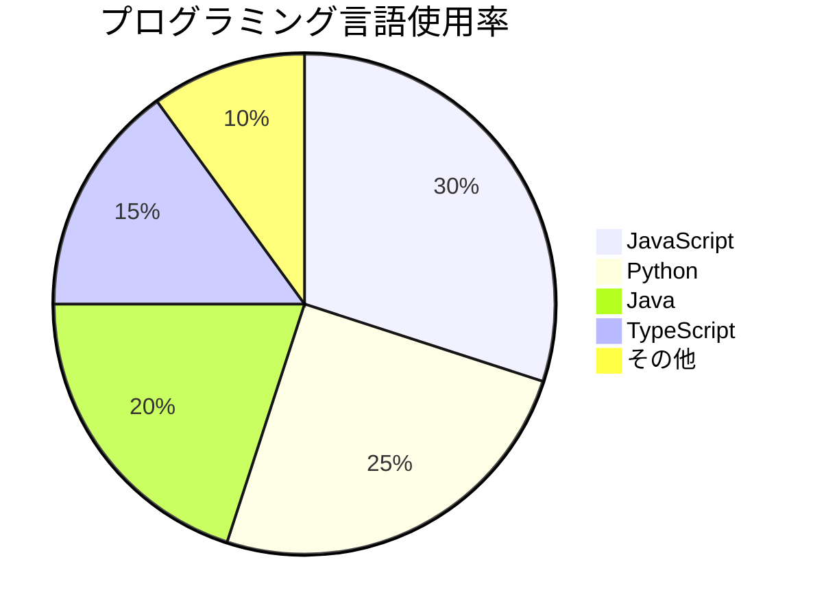

### 8. ジャーニーマップ
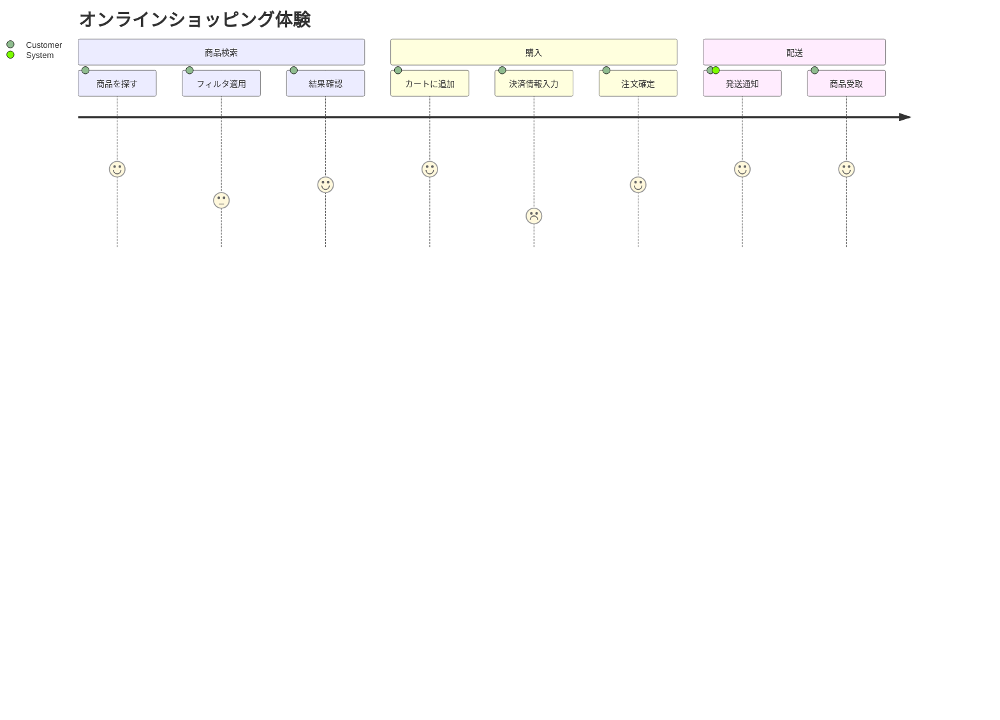

### 9. GitGraph
```mermaid
gitgraph
    commit id: "初期コミット"
    branch feature
    checkout feature
    commit id: "機能追加"
    commit id: "バグ修正"
    checkout main
    commit id: "hotfix"
    merge feature
    commit id: "リリース"
```

### 10. マインドマップ
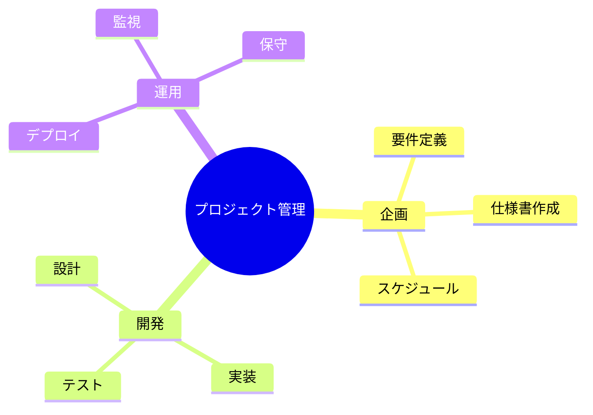

## PlantUML図表（10個）

### 1. ユースケース図
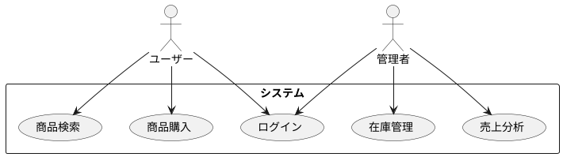

### 2. アクティビティ図
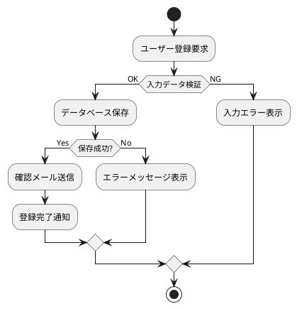

### 3. コンポーネント図
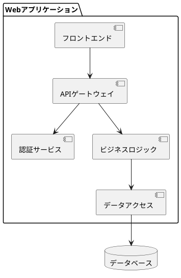

### 4. デプロイメント図
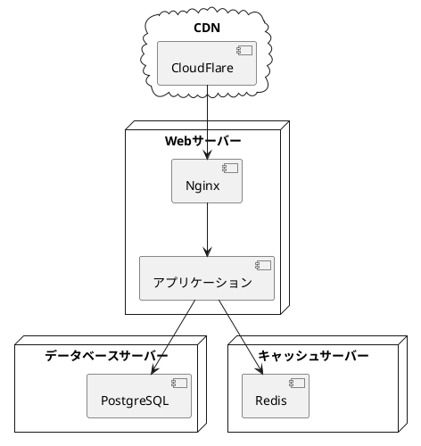

### 5. シーケンス図（詳細版）
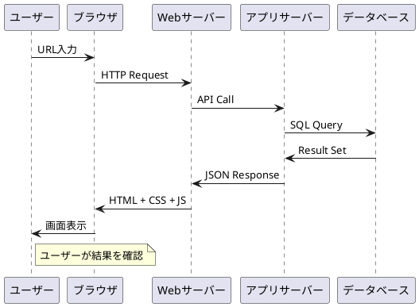

### 6. クラス図（詳細版）
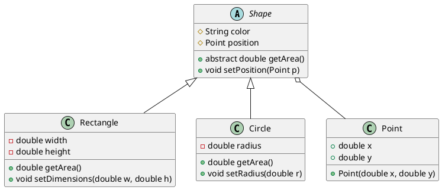

### 7. オブジェクト図
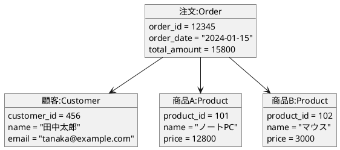

### 8. パッケージ図
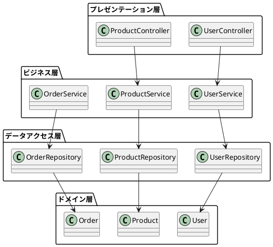

### 9. ネットワーク図
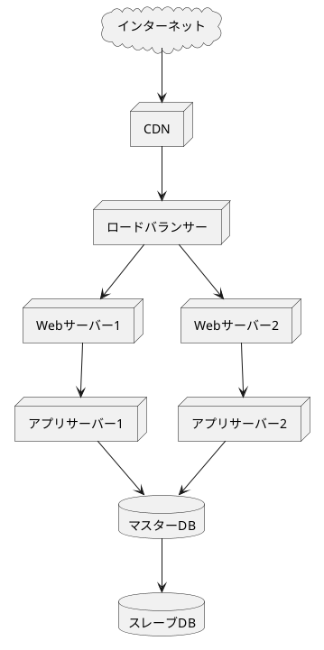

### 10. タイミング図
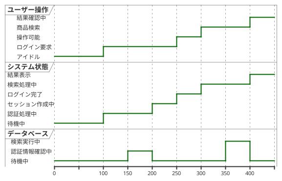

---

このドキュメントは性能テスト用に作成されており、合計20個の図表（Mermaid 10個、PlantUML 10個）を含んでいます。