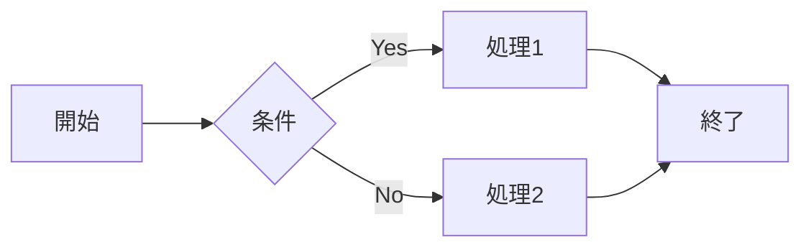
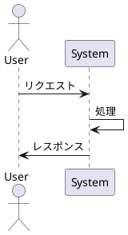
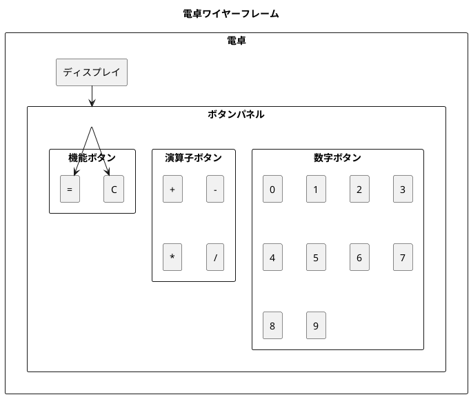

# md2pdf サンプルドキュメント

このドキュメントは、md2pdfツールの動作確認用のサンプルです。

## 基本的なMarkdown要素

### テキスト装飾

**太字**と*斜体*、そして`インラインコード`のテストです。

### リスト

- 項目1
- 項目2
  - サブ項目1
  - サブ項目2

1. 番号付きリスト1
2. 番号付きリスト2

### コードブロック

```javascript
function hello() {
    console.log("Hello, World!");
}
```

### 引用

> これは引用文のサンプルです。
> 複数行にわたる引用も対応しています。

### 表

| 項目 | 値  | 説明        |
| ---- | --- | ----------- |
| A    | 100 | サンプル値A |
| B    | 200 | サンプル値B |
| C    | 300 | サンプル値C |

## 図表のテスト

現在の基本バージョンでは、MermaidとPlantUMLの図表は後の実装で対応予定です。

### 今後対応予定の図表







---

これで基本的なMarkdown→PDF変換のテストが完了します。
